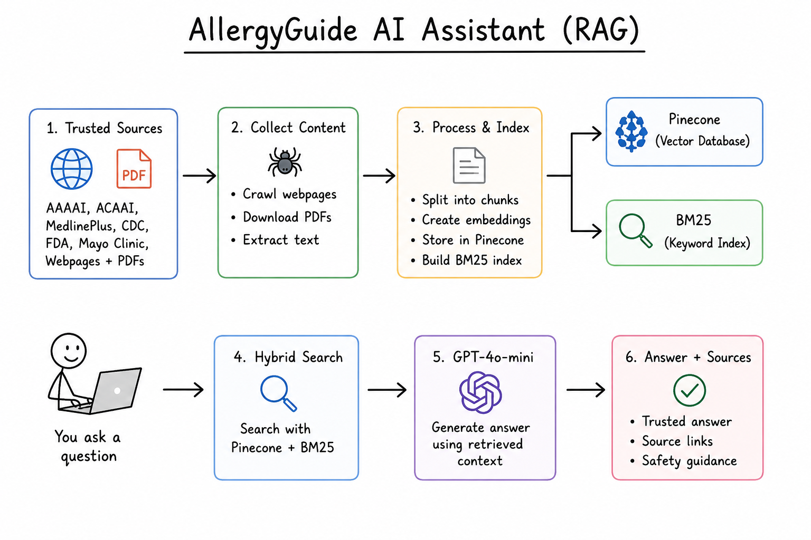
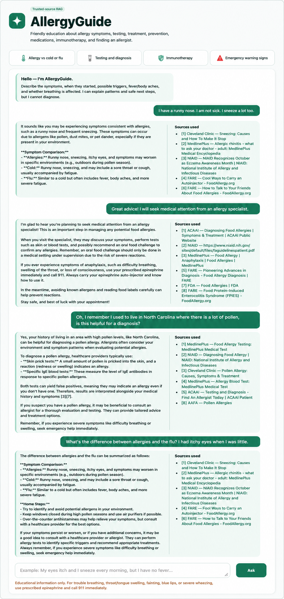

# AllergyGuide AI Assistant

A professional, friendly RAG chatbot for human allergy education. It crawls trusted allergy webpages and linked PDFs, creates embeddings, stores them in Pinecone, and answers with citations using OpenAI.

Sources: AAAAI, ACAAI, MedlinePlus, NIAID, CDC, FDA, AAFA, FARE, Mayo Clinic, and Cleveland Clinic.

## Workflow




## Output 




## Setup (Windows or macOS/Linux)

``` 
python -m venv .venv
```

Windows:

``` 
.venv\Scripts\activate
```

macOS/Linux:

``` 
source .venv/bin/activate
```

Install packages:

``` 
pip install -r requirements.txt
```

Copy `.env.example` to `.env`, then add your API keys.

## Build the knowledge base

Crawl webpages, subpages, and linked PDFs:

``` 
python crawl_allergy.py
```

Create the Pinecone index and upload chunks:

``` 
python store_index.py
```

Important: `all-MiniLM-L6-v2` produces 384-dimensional vectors. The script creates a 384-dimensional Pinecone index automatically and stops with a clear error if an existing index has another dimension.

## Run

``` 
python app.py
```

Open:

```text
http://127.0.0.1:8080
```

## Safety design

- It is education, not diagnosis.
- A deterministic emergency check runs before the LLM.
- It tells users not to perform food challenges or deliberate allergen exposure at home.
- It separates patient stories from clinical evidence.
- It cites retrieved source pages.
