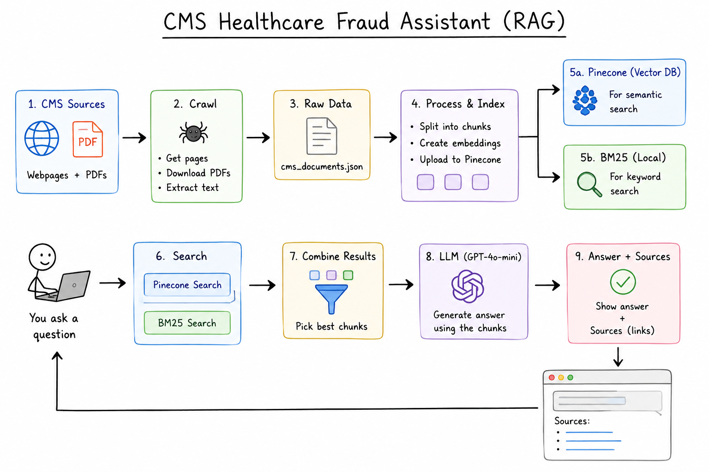
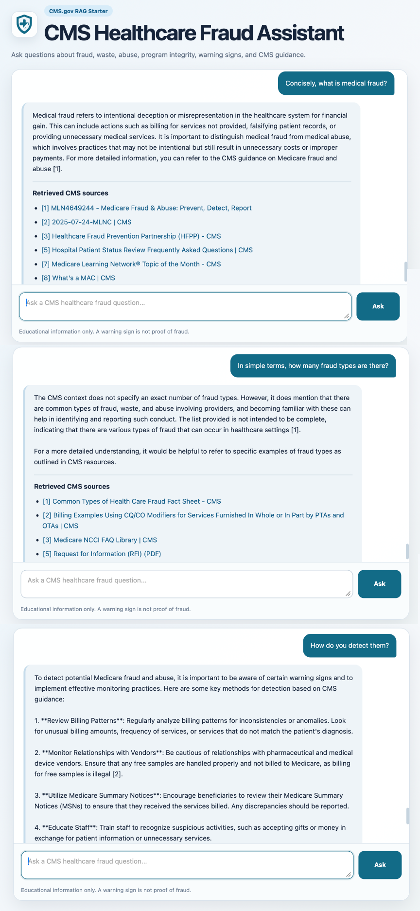

# CMS Healthcare Fraud Assistant


## Project Purpose:

**This project develops a Retrieval-Augmented Generation (RAG) chatbot that answers healthcare fraud, waste, abuse, and program integrity questions using official CMS resources (cms.gov). It helps users explore CMS guidance through accurate, source-grounded responses.**

<br>

## Workflow of Project



## Output of Chatbot




## Features

- Retrieves answers from official CMS webpages and PDFs
- Hybrid search using Pinecone vector search and BM25
- Generates grounded responses with source citations
- Uses a simple Flask-based chat interface

## Tech Stack

- Python
- Flask
- OpenAI GPT-4o-mini
- Pinecone
- LangChain
- Sentence Transformers
- BM25

## Installation

Install dependencies:

```bash
pip install -r requirements.txt
```

Add your API keys to a `.env` file:

```env
OPENAI_API_KEY=your_key
PINECONE_API_KEY=your_key
```

Build the knowledge base:

```bash
python crawl_cms.py
python store_index.py
```

Run the application:

```bash
python app.py
```

Open:

```
http://127.0.0.1:8080
```

## Example Questions

- What is medical fraud?
- How can fraud be detected?
- How do I report Medicare fraud?
- What are common warning signs?

## Disclaimer

This project is for educational purposes and provides answers grounded in publicly available CMS documentation (cms.gov).
